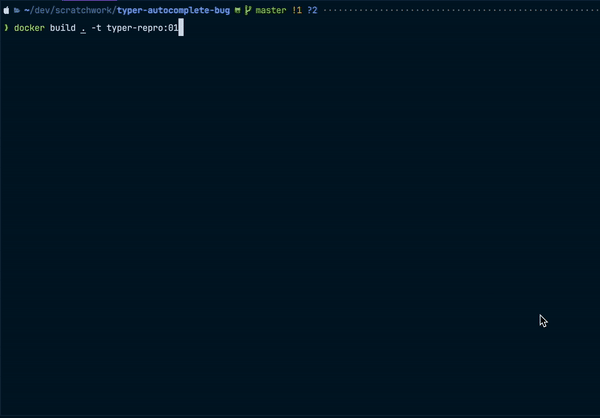

# Reproduction for typer autocomplete bug

This is a reproduction for https://github.com/fastapi/typer/discussions/965.

## Setup

1. Clone this repository
2. Run `docker build . -t typer-repro:01`
3. Run `docker run -it typer-repro:01`
4. Run `typer ./main.py run --name [TAB]` where `[TAB]` means "press the tab key"
5. Bug should be reproduced

## Expected behavior

```shell
typer ./main.py run --name [TAB]
```

should autocomplete to a list of names, where the list is: 

```text
"start-test-exmpl",
"start1234-other-exmpl",
"start1234-test-exmpl",
```

## Actual behavior

Tab completion results in:

```shell
typer ./main.py run --name start--exmpl
```



# Version tab completion bug

To view the version tab completion bug, follow the same steps above, but input:

```shell
typer ./main.py run --vers[TAB]
```

This will tab complete correctly to `--version`. When you type something thereafter, and then tab complete again, the bug will be reproduced.

```shell
typer ./main.py run --version [TAB]
typer ./main.py run --version (eval):1: command not found: Awesome
(eval):1: command not found: Awesome
(eval):1: command not found: Awesome
typer ./main.py
```
